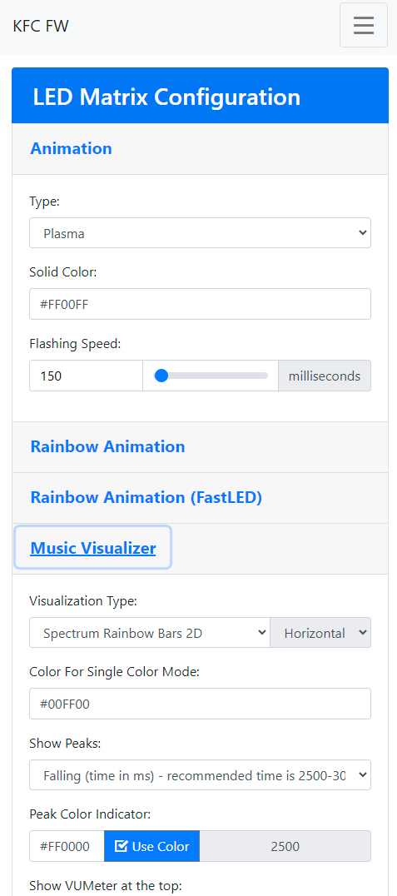
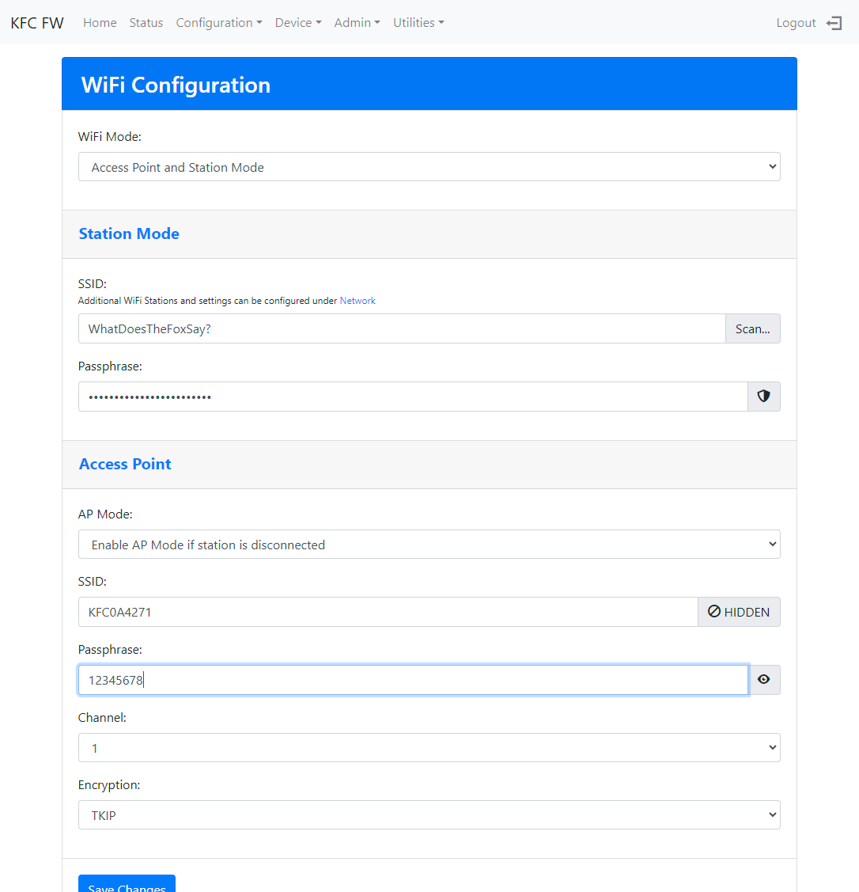

# KFCLibrary

A collection of my ESP8266/ESP32 libraries... Both the ESP8266_NONOS_SDK and the ESP32_RTOS_SDK are supported

## Compatibility

### ESP8266

- GCC 10.x
- Modified [framework-arduinoespressif8266](https://github.com/sascha432/Arduino) 
- [v3.1.2-mod](https://github.com/sascha432/Arduino/releases/tag/3.1.2-mod)

### ESP32

- GCC 8.4.x with gnu++17
- Modified [framework-arduinoespressif32](https://github.com/sascha432/arduino-esp32) 
- [v2.0.9-mod](https://github.com/sascha432/arduino-esp32/releases/tag/2.0.9-mod)

### KFCWebBuilder

Framework to build WebUIs with bootstrap and store them mostly compressed in a virtual file system. Combined with server side includes, complex dynamic web pages/forms with a low memory footprint can be created

#### Building the VFS

Following software is required to build the virtual file system. Compatible versions might work as well, the listed ones have been tested...

 - Java JRE 8 / openjdk-18-jre-headless
 - NodeJS v12 or v16
 - Install node dependencies with ``npm install``
 - PHP 7.4.x (8.x is not supported yet)
 - mklittlefs - If it is not being installed automatically, run ``pio pkg install -t "platformio/tool-mklittlefs@~1.203.0"``

Executables must be in ``PATH``. If you have PHP 8.x, install PHP 7.x from source and ``export PHPEXE=/home/sascha/Desktop/php-7.4.30/sapi/cli/php``. For Windows, create an environment variable ``PHPEXE`` pointing to php.exe

More details about binaries can be found/changed in [lib/KFCWebBuilder/KFCWebBuilder.json](lib/KFCWebBuilder/KFCWebBuilder.json)

### KFCVirtualFileSystem

include ``Arduino_combat.h``, which provides ``KFCFS_begin()`` and the ``KFCFS`` wrapper object. It can be used like the SPIFFS/LittleFS object, but adds transparent accesss to the read only VFS

### KFCWebFramework

Classes to create complex dynamic HTML forms (using bootstrap 4.5), server side validation of posted forms, dynamic menus, support for authenticated sessions and http headers

{width=150px} {width=500px}

### KFCSyslog

Send messages to a syslog server via UDP, TCP and TLS

### KFCOpenWeather

Library to get current weather and the forecast from [https://openweathermap.org/](https://openweathermap.org/)

### KFCEventScheduler

Platform independent timer, scheduler with prioritized queue, WiFi callbacks and loop functions

### KFCResetDetector

Detect crashes and offer safe mode by pressing the reset button during boot, count number of resets for extended functionality (reset configuration, open public hotspot etc...)
It also offers a RTC memory manager to store data identified by an unique id and crc check. An emulation of a RTC clock is included that will keep track of time during deep sleep and restarts

#### KFCResetDetector/SaveCrash for ESP8266

Store crash logs with checksum of the firmware, version and other details directly in flash memory. Does not allocate any memory and uses copy on write to ensure no data is lost. WebUI to review crash reports and download stack traces

### KFCConfiguration

Library to handle configurations stored in a NVS flash partition, read on demand to save memory, manage changes in structure automatically, export and import configuration as JSON

### KFCRestApi

Library to handle RESTful APIs using asyncHTTPrequest/KFCJson

### KFCPinMonitor

Support for push buttons with debouncing and rotary encoders. Different methods from polling, default interrupts or custom interrupt handlers are available

### KFCGfx

An extension for Adafruit_GFX and supported TFT/OLED displays. If offers fullscreen double buffering for flicker free output. The buffer is compressed to fit into the RAM of the ESP8266. A few extra methods for easier text output are available as well. Partial or full screen updates are supported, depending on the display features

### KFCBaseLibrary

- ``Arduino_compat.h`` cross platform support (ESP32/ESP8266/Win32 Console)
- ``asyncHTTPrequest`` for ESP32/ESP8266
- ``debug_helper.h`` for local and global debugging messages
- ``ReadADC.h`` offer a wrapper to read the ESP8266 ADC safely
- ``Mutex.h`` NONOS/RTOS_SDK compatible semaphores for ESP8266/ESP32
- ``PrintString.h`` a class that combbines ``String`` with the ``Print`` interface
- ``SSIProxyStream.h`` a class that offers server side includes and the creation of dynamic web pages/forms with a very small memory footprint
- ``DataProviderInterface.h`` a class to build dynamic web pages that are created on the fly (for ESPAsyncWebServer)
- ``misc.h`` a lot useful functions and classes
- ``section_defines.h`` partition management for the ESP8266 and ESP32
