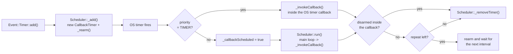

# CallbackTimer

`CallbackTimer` is a single timer owned by `Event::Scheduler`. The scheduler creates it, arms it,
invokes the callback and deletes it when it is done - user code never creates or deletes one.

- Sources: `include/CallbackTimer.h`, `src/CallbackTimer.cpp` (paths are relative to the
  `KFCEventScheduler` folder)
- Related: [ManagedTimer](ManagedTimer.md) (`Event::Timer`, the safe wrapper),
  [TaskQueue](TaskQueue.md)

## When to use it

| Need | Use |
| --- | --- |
| a timer in your own class | `Event::Timer` ([ManagedTimer](ManagedTimer.md)) |
| a one shot / interval / repeat | `Event::Timer::add()` |
| access the timer inside its callback | the `CallbackTimerPtr` argument of the callback |
| extremely low level control (rearm, interval, disarm) | `CallbackTimer` |

`CallbackTimer` itself is only needed when the callback has to inspect or modify its own timer.
Everything else should go through `Event::Timer`.

> `~CallbackTimer()` is private (`Timer`, `ManagedCallbackTimer` and `Scheduler` are friends), so a
> `CallbackTimer` can neither be put on the stack nor deleted by user code. The only supported way to
> get one is `Scheduler::add()`/`Event::Timer::add()` which returns/owns the pointer.

## Lifecycle



`_invokeCallback()` calls `_callback(timer)` and afterwards

- **removes** the timer when it was disarmed inside the callback (`isArmed() == false`),
- **removes** the timer when the repeat counter is exhausted (`RepeatType::_doRepeat()`),
- **rearms** it only for the manual chunking of very long intervals (see below),
- leaves a repeating timer alone: the OS timer (`ets_timer`/`esp_timer`) repeats by itself.

## Execution context and priorities

The callback is invoked by `__Scheduler.run()`, i.e. **in the main loop** - with one exception:
`PriorityType::TIMER` runs the callback directly from the OS timer callback context, which is the
WiFi/sys (ESP8266) or the `esp_timer` task (ESP32). Everything that is not ISR/timer safe must be
deferred with [TaskQueue](TaskQueue.md) or `LoopFunctions::callOnce()`.

| Priority | Runs in | Runtime limit |
| --- | --- | --- |
| `PriorityType::TIMER` | OS timer callback context | 5000 µs soft |
| `> NORMAL` (`HIGH`, `HIGHER`, `HIGHEST`) | main loop, no time limit | 15000 µs soft |
| `NORMAL` and below | main loop | 250 ms hard per loop pass, all `NORMAL`/lower timers together |

- `kMaxRuntimeLimit` (250 ms) is a hard limit per `__Scheduler.run()` call: once exceeded, the
  remaining `NORMAL` and lower timers wait for the next loop pass.
- The µs limits are soft: exceeding them only logs a warning in debug builds.
- Lower priorities can be delayed by the program or by other timers, `TIMER` is the only priority
  with a guaranteed execution.

## API

```cpp
class CallbackTimer {
public:
    bool isArmed() const;                       // the OS timer is running
    int64_t getInterval() const;                // configured interval in ms
    uint32_t getShortInterval() const;          // interval as uint32_t (asserts that it fits)

    void setInterval(milliseconds interval);            // rearm with a new interval
    bool updateInterval(milliseconds interval);         // rearm only if the interval changed, returns true if it did

    // rearm with a new interval, repeat type and/or callback
    // RepeatType() keeps the current repeat type, a null callback keeps the current callback
    void rearm(int64_t intervalMillis, RepeatType repeat = RepeatType(), Callback callback = nullptr);
    void rearm(milliseconds interval, RepeatType repeat = RepeatType(), Callback callback = nullptr);

    void disarm();                              // stop the timer, call this inside the callback
    SemaphoreMutex &getLock();
};
```

| Method | Call from | Notes |
| --- | --- | --- |
| `disarm()` | inside the callback | the scheduler removes the timer after the callback returns |
| `rearm()`, `setInterval()`, `updateInterval()` | inside the callback | the interval/repeat/callback can be changed, the priority is kept. There is no internal locking - this is safe because the callback runs with the timer mutex released. |
| `getInterval()`, `getShortInterval()`, `isArmed()` | anywhere | plain reads |
| `getLock()` | anywhere | `SemaphoreMutex` of the timer; the scheduler holds it while it invokes the callback (released for the callback itself) and around `_add()`/`_removeTimer()` |

Details:

- `rearm()` clamps the interval to `Event::kMinDelay` (5 ms on ESP8266, 1 ms on ESP32) and asserts
  that the delay is not smaller.
- `RepeatType()` (= `kPreset`) keeps the current repeat type, `RepeatType(true)` repeats unlimited,
  `RepeatType(false)`/`RepeatType(1)` fires once, `RepeatType(n)` fires `n` times.
  `getRepeatsLeft()` returns the remaining repetitions.
- A timer that is disarmed inside the callback is deleted right after the callback - do not use the
  pointer afterwards.
- `Scheduler::remove(timer)` or `Event::Timer::remove()` removes the timer from outside the callback.
- Longer intervals than `Event::kMaxDelay` are split into `kMaxDelay` sized chunks (`_remainingDelay`)
  on the platforms with `SCHEDULER_HAVE_REMAINING_DELAY` (ESP8266/`_MSC_VER`) and rescheduled
  manually. On ESP32 the native `esp_timer` handles the full 64 bit range.
- `Event::CallbackTimerSize` is `sizeof(CallbackTimer)` for memory budgeting.

## Examples

### Change the interval from inside the callback

```cpp
#include <EventScheduler.h>

class Poller {
public:
    void start() {
        _timer.add(Event::milliseconds(1000), Event::RepeatType(true), [this](Event::CallbackTimerPtr timer) {
            if (_pollFailed()) {
                // slow down: retry every 5 s instead of every second
                timer->rearm(Event::milliseconds(5000));
            }
            else if (timer->getInterval() != 1000) {
                timer->rearm(Event::milliseconds(1000));
            }
        });
    }

private:
    bool _pollFailed() { return false; }

    Event::Timer _timer;
};
```

`timer->rearm(...)` keeps the repeat type and the callback (both are optional arguments).

### Run exactly once

```cpp
_timer.add(Event::milliseconds(250), Event::RepeatType(false), [this](Event::CallbackTimerPtr timer) {
    _flush();
    timer->disarm();        // removed by the scheduler after this callback
});
```

`RepeatType(false)` already makes it a one shot, the `disarm()` variant is useful when the decision
to stop is made at runtime.

### Repeating a limited number of times

```cpp
// 5 calls, 200 ms apart
_timer.add(Event::milliseconds(200), Event::RepeatType(5), [this](Event::CallbackTimerPtr timer) {
    __LDBG_printf("repeats left=%u", timer->getRepeatsLeft());
});
```

### Throttle

`Event::Timer::throttle()` uses this API internally: the first call within `delayMillis` is ignored,
a later call runs the callback delayed by `delayMillis` and blocks further calls for that time.

## Pitfalls

- **Do not delete the timer** - only the scheduler owns it (the destructor is private).
- **Do not store the `CallbackTimerPtr`** beyond the lifetime of the timer; after `disarm()` /
  `remove()` it points to freed memory.
- **`disarm()` from outside the callback** is a plain stop, not a removal - the timer object stays in
  the scheduler list until it is removed. `Event::Timer::remove()` does both.
- Do not call `rearm()` with an interval below `kMinDelay` and do not pass an empty `Callback`.
- The callback runs with the timer lock released, but the timer object is not protected against
  concurrent access from other tasks - use `getLock()` if the timer has to be touched from another
  context.
- `+DUMPT` prints all timers (see `docs/AtModeHelp.md` in the kfc_fw project).

## See also

- [ManagedTimer](ManagedTimer.md) - `Event::Timer` and `ManagedCallbackTimer`
- `include/Scheduler.h` - `Scheduler::add()`/`remove()`, `PriorityType`
- `include/Event.h` - `RepeatType`, `Callback`, `PriorityType`, `kMinDelay`/`kMaxDelay`
- `include/Timer.h` - the recommended `Event::Timer` API
